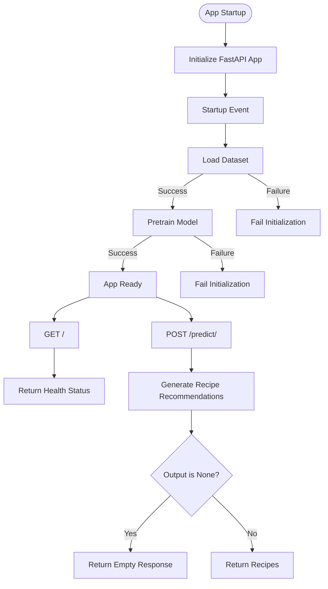

[](https://zenodo.org/doi/10.5281/zenodo.12507163)

<h1 align="center">Diet Recommendation System</h1>
<div align= "center">
  <h4>A diet recommendation web application using content-based approach with Scikit-Learn, FastAPI and Streamlit.</h4>
</div>

# Diet-Recommendation-System

## :bookmark_tabs:Table of contents
* [General info](#general-info)
* [Development](#development)
* [Technologies](#technologies)
* [Setup](#setup)

## :scroll: General info
### Motivation
People from all around the world are getting more concerned in their health and way of life in today's modern environment. However, avoiding junk food and exercising alone are insufficient; we also need to eat a balanced diet. We can live a healthy life with a balanced diet based on our height, weight, and age. Your diet can help you achieve and maintain a healthy weight, lower your chance of developing chronic diseases (including cancer and heart disease), and improve your general health when combined with physical activity. Nevertheless, there is a little SOTA project on food/diet recommendation system. Therefore I got the idea to build a content-based recommendation system for this purpose using machine learning. 
### What is a food recommendation engine?
A food recommendation engine using a content-based approach is an important tool for promoting healthy eating habits. This type of engine uses information about the nutritional content and ingredients of foods to make personalized recommendations to users. One of the key advantages of a content-based approach is that it takes into account an individual's dietary restrictions and preferences, such as allergies or food preferences. By providing users with tailored recommendations, a content-based food recommendation engine can help them make better choices about what to eat and improve their overall health. Additionally, by recommending a variety of healthy foods, it can also help users to discover new and nutritious options, expand their dietary horizons and overcome food boredom. All these can lead to a better and well-rounded diet, which can have a positive impact on long-term health outcomes.

### What is a content-based recommendation engine?
A content-based recommendation engine is a type of recommendation system that uses the characteristics or content of an item to recommend similar items to users. It works by analyzing the content of items, such as text, images, or audio, and identifying patterns or features that are associated with certain items. These patterns or features are then used to compare items and recommend similar ones to users.
<div align= "center"></div>

### Why content-based approach?

* No data from other users is required to start making recommendations.
* Recommendations are highly relevant to the user.
* Recommendations are transparent to the user.
* You avoid the “cold start” problem. 
* Content-based filtering systems are generally easier to create.

### Challenges of content-based approach
* There’s a lack of novelty and diversity.
* Scalability is a challenge.
* Attributes may be incorrect or inconsistent. 

## :computer:Development
### Model developement
The recommendation engine is built using Nearest Neighbors alogrithm which is an unsupervised learner for implementing neighbor searches. It acts as a uniform interface to three different nearest neighbors algorithms: BallTree, KDTree, and a brute-force algorithm based on routines in sklearn.metrics.pairwise. For our case, we used the brute-force algorithm using cosine similarity due to its fast computation for small datasets.

$$cos(theta) = (A * B) / (||A|| * ||B||)$$

### Dataset
I used Food.com kaggle dataset Data with over 500,000 recipes and 1,400,000 reviews from Food.com. Visit this [kaggle](https://www.kaggle.com/datasets/irkaal/foodcom-recipes-and-reviews?select=recipes.csv) link for more details.
### Backend Developement
The application is built using the FastAPI framework, which allows for the creation of fast and efficient web APIs. When a user makes a request to the API (user data,nutrition data...) the model is used to generate a list of recommended food similar/suitable to his request (data) which are then returned to the user via the API.

### Frontend Developement

The application's front-end is made with Streamlit. Streamlit is an open source app framework in Python language. It helps to create web apps for data science and machine learning in a short time. It is compatible with major Python libraries such as scikit-learn, Keras, PyTorch, SymPy(latex), NumPy, pandas, Matplotlib etc. For our case the front-end is composed of three web pages. The main page is Hello.py which is a welcoming page used to introduce you to my project. The side bar on the left allows the user to navigate too the automatic diet recommendation page and the custom food recommendation page. In the diet recommendation page the user can fill information about his age,weight,height.. and gets a diet recommendation based on his information. Besides, the custom food recommendation allows the user to specify more his food preferency using nutritional values.

### Deployement using Docker
#### Why Docker?
By using Docker, you can ensure that the environment in which the application is exactly the same as the environment in which it was built, which can help prevent unexpected issues and improve model performance. Additionally, Docker allows for easy scaling and management of the deployment, making it a great choice for larger machine learning projects.
#### Docker-Compose
My project is composed of different services (frontend,API). Therefore, our application should run on multiple containers. With the help of Docker-compose we can share our application using the yaml file that define the services that runs together.

### Project Architecture

<div align= "center"></div>


## :rocket: Technologies
The project is created with:
* Python: 3.10.8
* fastapi 0.88.0
* uvicorn 0.20.0
* scikit-learn 1.1.3
* Pandas: 1.5.1
* Streamlit: 1.16.0
* streamlit-echarts 1.24.1
* Numpy: 1.21.5
* beautifulsoup4 4.11.1

 

## :whale: Setup

### Run it locally
#### Clone the repo
```
$ git clone https://github.com/zakaria-narjis/Diet-Recommendation-System
```
### docker-compose
In the project root run:
```
$ docker-compose up -d --build
```
Then open http://localhost:8501 and enjoy :smiley:.

PS: You should have docker and docker-compose already installed
### Use the hosted version on Streamlit Cloud

https://diet-recommendation-system.streamlit.app/

## Citation
```
@software{narjis_2024_12507829,
  author       = {Narjis, Zakaria},
  title        = {Diet recommendation system},
  month        = jun,
  year         = 2024,
  publisher    = {Zenodo},
  version      = {v1.0.1},
  doi          = {10.5281/zenodo.12507829},
  url          = {https://doi.org/10.5281/zenodo.12507829}
}
```

## Diagram

## Table
| RecipeId | Name                                | CookTime | PrepTime | TotalTime | Calories | FatContent | SaturatedFatContent | CholesterolContent | SodiumContent | CarbohydrateContent | FiberContent | SugarContent | ProteinContent | RecipeIngredientParts | RecipeInstructions |
|----------|-------------------------------------|---------|---------|----------|---------|-----------|-------------------|-----------------|--------------|-------------------|-------------|-------------|----------------|---------------------|------------------|
| 38       | Low-Fat Berry Blue Frozen Dessert   | 1440    | 45      | 1485     | 170.9   | 2.5       | 1.3               | 8.0             | 29.8         | 37.1              | 3.6         | 30.2        | 3.2            | blueberries<br>granulated sugar<br>vanilla yogurt<br>lemon juice | Toss 2 cups berries with sugar.<br>Let stand for 45 minutes, stirring occasionally.<br>Transfer berry-sugar mixture to food processor.<br>Add yogurt and process until smooth.<br>Strain through fine sieve. Pour into baking pan (or transfer to ice cream maker and process according to manufacturers' directions). Freeze uncovered until edges are solid but centre is soft. Transfer to processor and blend until smooth again.<br>Return to pan and freeze until edges are solid.<br>Transfer to processor and blend until smooth again.<br>Fold in remaining 2 cups of blueberries.<br>Pour into plastic mold and freeze overnight. Let soften slightly to serve. |
| 41       | Carina's Tofu-Vegetable Kebabs     | 20      | 1440    | 1460     | 536.1   | 24.0      | 3.8               | 0.0             | 1558.6       | 64.2              | 17.3        | 32.1        | 29.3           | extra firm tofu<br>eggplant<br>zucchini<br>mushrooms<br>soy sauce<br>low sodium soy sauce<br>olive oil<br>maple syrup<br>honey<br>red wine vinegar<br>lemon juice<br>garlic cloves<br>mustard powder<br>black pepper | Drain the tofu, carefully squeezing out excess water, and pat dry with paper towels.<br>Cut tofu into one-inch squares.<br>Set aside. Cut eggplant lengthwise in half, then cut each half into approximately three strips.<br>Cut strips crosswise into one-inch cubes.<br>Slice zucchini into half-inch thick slices.<br>Cut red pepper in half, removing stem and seeds, and cut each half into one-inch squares.<br>Wipe mushrooms clean with a moist paper towel and remove stems.<br>Thread tofu and vegetables onto barbecue skewers in alternating color combinations.<br>Continue in this way until all skewers are full.<br>Make the marinade by putting all ingredients in a blender, and blend on high speed for about one minute until mixed.<br>Alternatively, put all ingredients in a glass jar, cover tightly and shake well until mixed.<br>Lay the kebabs in a long, shallow baking pan or on a non-metal tray, making sure they lie flat. Evenly pour the marinade over the kebabs, turning them once so that the tofu and vegetables are coated.<br>Refrigerate the kebabs for three to eight hours, occasionally spooning the marinade over them.<br>Broil or grill the kebabs at 450 F for 15-20 minutes, or on the grill, until the vegetables are browned.<br>Suggestions: This meal can be served over cooked, brown rice. Amounts can easily be doubled to make four servings. |
| 42       | Cabbage Soup                        | 30      | 20      | 50       | 103.6   | 0.4       | 0.1               | 0.0             | 959.3        | 25.1              | 4.8         | 17.7        | 4.3            | plain tomato juice<br>cabbage<br>onion<br>carrots<br>celery | Mix everything together and bring to a boil.<br>Reduce heat and simmer for 30 minutes (longer if you prefer your veggies to be soft).<br>Refrigerate until cool.<br>Serve chilled with sour cream. |
| 45       | Buttermilk Pie With Gingersnap Crumb Crust | 50      | 30      | 80       | 228.0   | 7.1       | 1.7               | 24.5            | 281.8        | 37.5              | 0.5         | 24.7        | 4.2            | sugar<br>margarine<br>egg<br>flour<br>salt<br>buttermilk<br>graham cracker crumbs<br>margarine | Preheat oven to 350°F.<br>Make pie crust, using 8 inch pie pan, do not bake.<br>Mix sugar and margarine in medium bowl until blended; beat in egg whites and egg.<br>Stir in flour, salt, and buttermilk until well blended.<br>Pour filling into prepared crust, bake 40 minutes or until sharp knife inserted near center comes out clean.<br>Sprinkle with nutmeg and serve warm or chilled.<br>Combine graham crumbs, gingersnap crumbs, and margarine in 8 or 9 inch pie pan, pat mixture evenly on bottom and side of pan.<br>Bake 8 to 10 minutes or until edge of crust is lightly browned.<br>Cool on wire rack. |

